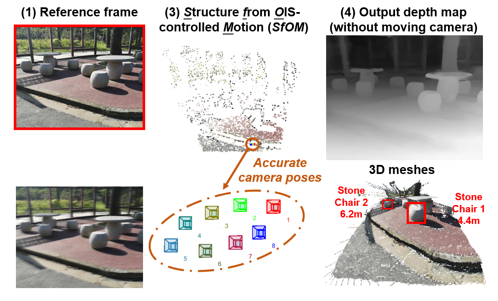

Fig.1 Our project applies acoustic injection to alter readings from the built-in MEMS gyroscope to control the lens motion in OIS-supported smartphone cameras, and further enables the depth estimation and super resolution through our proposed multi-frame based technologies

Smartphones are widely used for photography due to their portability and convenience. It’s reported that 90.9% of all photos are taken with smartphones in 2021, and a growing number of professional photographers are adopting mobile cameras as one of their primary photographic tools. To accommodate the diverse needs from casual photos of everyday life to professional photos, smartphone manufacturers have been enhancing phone cameras by installing more lenses, image sensors with larger and higher resolutions, depth sensors, etc. Upgrades to camera hardware have further facilitated new applications, including depth maps, 3D modeling, augmented reality, etc.; however, upgrades have also significantly increased the cost of smartphones. In this project, we show that, without adding additional hardware, we can enhance the functionality of existing smartphone cameras by controlling the Optical Image Stabilization (OIS) module.

Fig.2 Top sub-figures show the original image captured by the Xiaomi 11Pro camera, whereas the bottom sub-figures show the super-resolution results obtained using the OISSR system

## OIS based super resolution (OISSR)
We sought to develop a robust multi-frame-based super resolution method (called OISSR) for use on smartphone cameras with optical image stabilizer (OIS). After delving into the working principle of OIS, acoustic injection is used to alter the readings from the built-in MEMS gyroscope to control the lens motion in the OIS module (note that the image sensor is fixed). We employ a priori knowledge of the induced lens motion to facilitate optical flow estimation with sub-pixel accuracy, and the output high-precision pixel alignment vectors are utilized to merge the multiple frames to reconstruct the final super resolution image. Extensive experiments on a OISSR prototype implemented on a Xiaomi 10Ultra smartphone demonstrate the high performance and effectiveness of the proposed system in obtaining the quadruple enhanced resolution imaging.

Fig.3 Structure from OIS-controlled Motion (SfOM) algorithm is proposed to recover the accurate camera poses, and high quality dense depth map can be estimate

## Depth Sensing with an OIS Camera (DoCam)
We dig into the potential of the existing OIS techniques in depth sensing and propose DoCam, the first work that utilizes the OIS-controlled lens motion to perceive metric depth of scene. We develop a unified framework by which to estimate accurate camera poses from image sequences with a micro-scale stereo baseline for use in high-quality depth estimation. Specifically, the bundle adjustment is reformulated by applying constraints on the multi-view geometry and the OIS controlling signal. Thus, our system is able to achieve high-quality depth estimation without additional camera movement, making it particularly suitable for scenarios where the camera is fixed and requiring surrounding 3D information.
