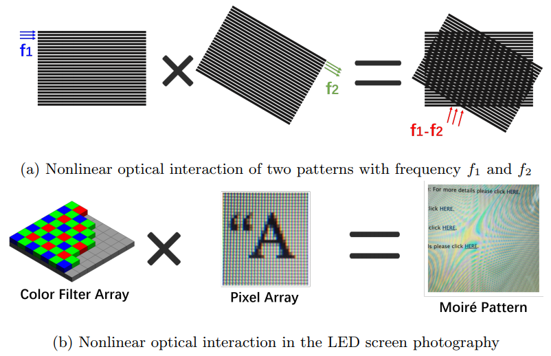
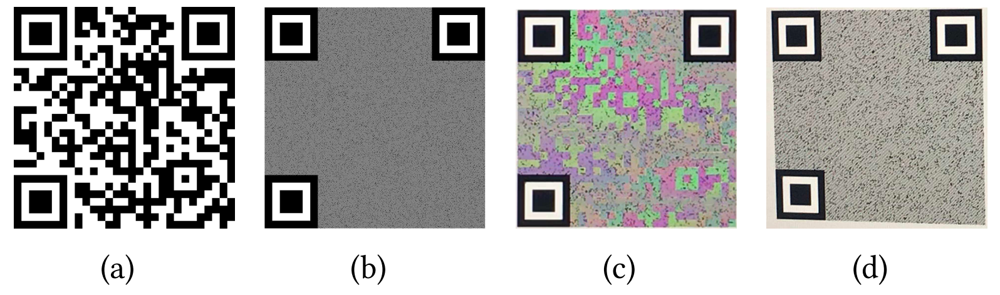

Fig.1 (a) QR code can be easily captured by other attackers (in the red area), the captured QR code images mages are at risk of Replay and STLS attack; (b) Real-world cases that happened in Shanghai. The attackers use someone else's payment code to conduct multiple illegal transactions

## Summary
The matrix barcodes known as quick response (QR) codes are a global phenomenon. Unfortunately, QR code systems are susceptible to security risks in the form of Replay attacks and Synchronized Token Lifting and Spending (STLS) attacks. In both attacks, an attacker sneakingly obtains the victim’s QR code to make other payment or access the victim’s private information. In this project, we sought to imrove the security of the traditional QR code system from the hardware characteristics of the digital cameras and screens. 

Fig.2 Two examples of the nonlinearity of spatial frequency in light

Fig.3 Encrypted QR code image can be naturally revealed when the camera is held in the designated position. (a) Original QR code. (b) Encrypted QR code. (c) Picture taken at designated position. (d) Picture taken at wrong position (off by 15°)

### mQRCode
If only the target receiver can capture the QR code information at the designated position, and from any other positions, the attackers can only capture the camouflaged image with no valid information. In this project, we propose a novel QR code encryption algorithm based on the nonlinearity of spatial frequency in light (see Fig.1). Digital camera depends on the color filter array (CFA) to capture the RGB color information of the scene, and Bayer CFA is the most common filter deployed on the smartphone cameras. When capturing a picture of a screen, the pixels of the screen LCD/OLED sensors projected onto camera form a spatial pattern layer with spatial frequency f1, and the CFA forms the other layer with frequency f2. When the camera is positioned at an appropriate position to the screen, the difference between spatial frequencies (f1 - f2) caused by nonlinear phoenomenon (also called Moiré effect) falls within an observable frequency range, such that the nonlinear optical interaction appears as a rippled image. Thus, we propose mQRCode, which exploits nonlinearities in the spatial frequency of light rays to camouflage QR codes from the communication channel. When a QR code is generated, mQRCode encrypts it within a pattern that is regarded as noise (from the perspective of the human visual system) using a designated spatial frequency. Only when the targeted camera in a designated position , the original QR code is revealed in form of a Moiré pattern. From any other position, only the camouflaged QR code can be seen. Please refer to Fig.3 for details. 

### ScreenID
If the receiver can identify the transmitter device identification, the Replay and STLS attacks will fail because they cannot use the same transmitter device to display the captured QR code image. In the majority of digital screens, pulse width modulation (PWM) is one of the most common approaches to control screen brightness for modern screens. PWM frequency makes a good candidate for screen fingerprint as it possesses several properties. First, PWM frequencies are adjusted to different values by screen manufacturers for reasons such as cost control and power consumption. Second, even for the same manufacture, the PWM frequency shows variances due to the variations in the manufacturing processes. Thus, We propose ScreenID, which embeds a QR code with information of the screen that is displaying it, thereby the generated QR code can reveal whether the screen is corresponding to it.
